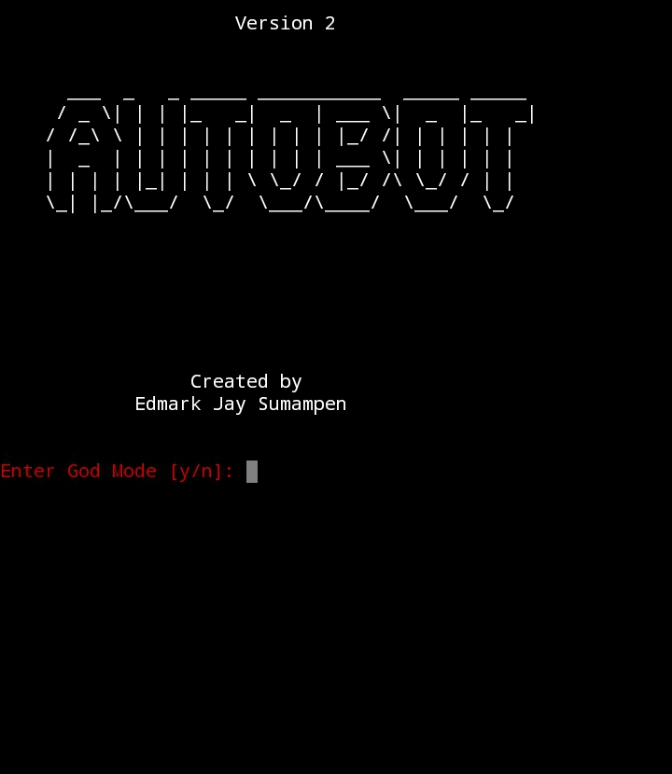
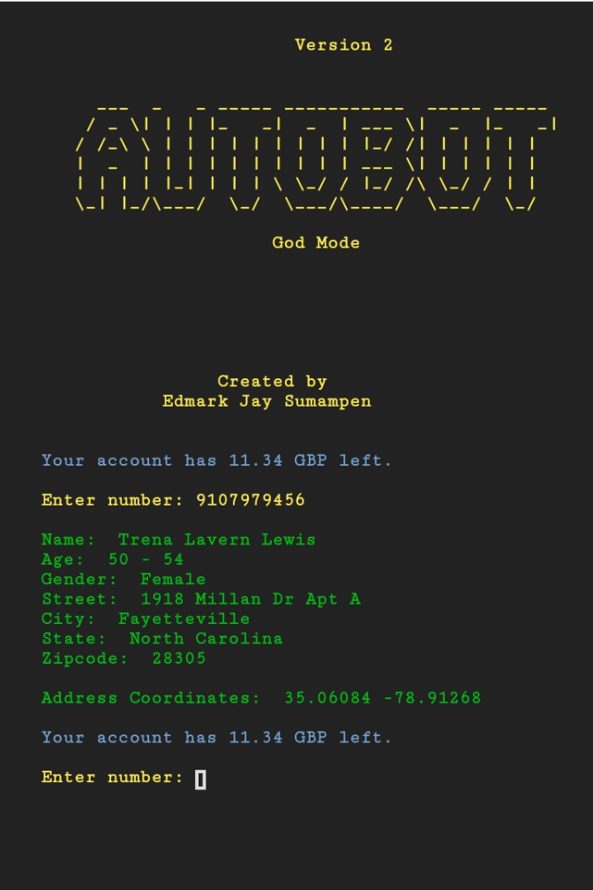
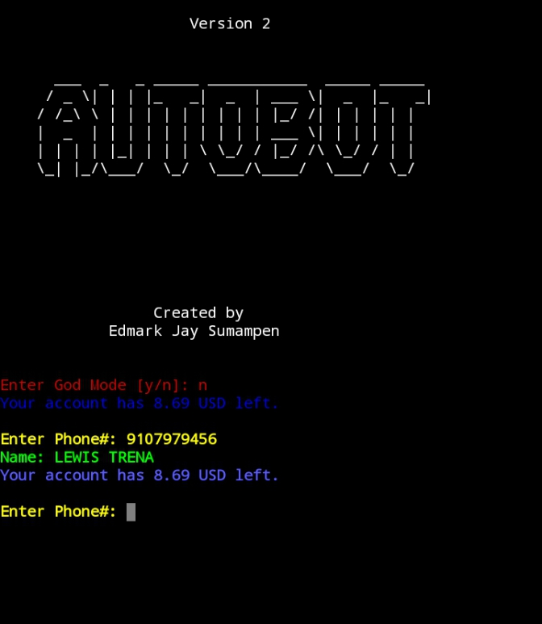

# autobot
helps you to identify phone numbers, the name associated with that number and even their addresses. 

How to use?

Installation

$ git clone https://github.com/edmark21/autobot

$ cd autobot

$ pip3 install --upgrade pip

$ pip3 install -r requirements.txt

(run the program by typing:)

$ python3 autobot.py

enjoyyy....
